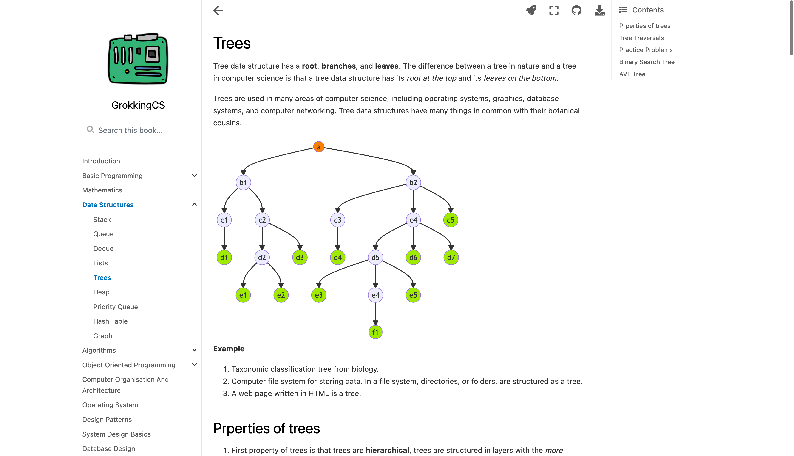

<!--
Hey, thanks for using the awesome-readme-template template.  
If you have any enhancements, then fork this project and create a pull request 
or just open an issue with the label "enhancement".

Don't forget to give this project a star for additional support ;)
Maybe you can mention me or this repo in the acknowledgements too
-->
<div align="center">

  
  <h1>GrokkingCS</h1>
  
  <p>
    A computer science guide for people in hurry.
  </p>
  
  
<!-- Badges -->
<p>
  <a href="https://github.com/RatanShreshtha/GrokkingCS/graphs/contributors">
    
  </a>
  <a href="">
    
  </a>
  <a href="https://github.com/RatanShreshtha/GrokkingCS/network/members">
    
  </a>
  <a href="https://github.com/RatanShreshtha/GrokkingCS/stargazers">
    
  </a>
  <a href="https://github.com/RatanShreshtha/GrokkingCS/issues/">
    
  </a>
  <a href="https://github.com/RatanShreshtha/GrokkingCS/blob/master/LICENSE">
    
  </a>
</p>
   
<h4>
    <a href="https://ratanshreshtha.github.io/GrokkingCS">View Demo</a>
  <span> · </span>
    <a href="https://github.com/RatanShreshtha/GrokkingCS/blob/main/README.md">Documentation</a>
  <span> · </span>
    <a href="https://github.com/RatanShreshtha/GrokkingCS/issues/">Report Bug</a>
  <span> · </span>
    <a href="https://github.com/RatanShreshtha/GrokkingCS/issues/">Request Feature</a>
  </h4>
</div>

<br />

<!-- Table of Contents -->
# :notebook_with_decorative_cover: Table of Contents

- [:notebook_with_decorative_cover: Table of Contents](#notebook_with_decorative_cover-table-of-contents)
  - [:star2: About the Project](#star2-about-the-project)
    - [:camera: Screenshots](#camera-screenshots)
    - [:space_invader: Tech Stack](#space_invader-tech-stack)
    - [:running: Run Locally](#running-run-locally)
    - [:triangular_flag_on_post: Deployment](#triangular_flag_on_post-deployment)
  - [:eyes: Usage](#eyes-usage)
  - [:compass: Roadmap](#compass-roadmap)
  - [:wave: Contributing](#wave-contributing)
    - [:scroll: Code of Conduct](#scroll-code-of-conduct)
  - [:warning: License](#warning-license)
  - [:handshake: Contact](#handshake-contact)
  - [:gem: Acknowledgements](#gem-acknowledgements)

  

<!-- About the Project -->
## :star2: About the Project

GrokkingCS is an open source project for learning and revising computer science in a hurry for your upcoming technical interviews or just for fun it provides beautiful well organized layout along with interactivity.

<!-- Screenshots -->
### :camera: Screenshots

<div align="center"> 
  
</div>


<!-- TechStack -->
### :space_invader: Tech Stack

<details>
  <summary>Built With</summary>
  <ul>
    <li><a href="https://www.python.org/">Python</a></li>
    <li><a href="https://jupyterbook.org">Jupyter Book</a></li>
  </ul>
</details>

<!-- Run Locally -->
### :running: Run Locally

If you'd like to develop and/or build the GrokkingCS book, you should:

Clone the project

```bash
  git clone https://github.com/RatanShreshtha/GrokkingCS.git
```

Go to the project directory

```bash
  cd GrokkingCS
```

Install dependencies

```bash
  pip install -r requirements.txt
```

Edit the books source files located in the `src/` directory

Cleanup the old builds in local directory 

```bash
  jupyter-book clean src/
```

Build the notebook in local directory 

```bash
  jupyter-book build src/
```

A fully-rendered HTML version of the book will be built in `src/_build/html/`.


<!-- Deployment -->
### :triangular_flag_on_post: Deployment

Please see the [Jupyter Book documentation](https://jupyterbook.org/publish/web.html) to discover options for deploying a book online using services such as GitHub, GitLab, or Netlify.

For GitHub and GitLab deployment specifically, the [cookiecutter-jupyter-book](https://github.com/executablebooks/cookiecutter-jupyter-book) includes templates for, and information about, optional continuous integration (CI) workflow files to help easily and automatically deploy books online with GitHub or GitLab. For example, if you chose `github` for the `include_ci` cookiecutter option, your book template was created with a GitHub actions workflow file that, once pushed to GitHub, automatically renders and pushes your book to the `gh-pages` branch of your repo and hosts it on GitHub Pages when a push or pull request is made to the main branch.

<!-- Usage -->
## :eyes: Usage

Use this interactive book by visiting https://ratanshreshtha.github.io/GrokkingCS/.

<!-- Roadmap -->
## :compass: Roadmap

- [x] Introduction
- [ ] Basic Programming
- [ ] Mathematics
- [x] Data Structures
- [x] Algorithms
- [x] Object Oriented Programming
- [ ] Design Patterns
- [ ] Computer Organization And Architecture
- [ ] Operating System
- [ ] Computer Networks
- [ ] Cryptography
- [ ] Database Design
- [x] System Design
- [ ] Testing
- [ ] Information Theory

See the [open issues](https://github.com/RatanShreshtha/GrokkingCS/issues) for a full list of proposed features (and known issues).

<!-- Contributing -->
## :wave: Contributing

<a href="https://github.com/RatanShreshtha/GrokkingCS/graphs/contributors">
  
</a>


Contributions are always welcome!

See `CONTRIBUTING.md` for ways to get started.


<!-- Code of Conduct -->
### :scroll: Code of Conduct

Please read the [Code of Conduct](https://github.com/RatanShreshtha/GrokkingCS/blob/master/CODE_OF_CONDUCT.md)

<!-- License -->
## :warning: License

Distributed under the MIT License. See `LICENSE` for more information.


<!-- Contact -->
## :handshake: Contact

Ratan Kulshreshtha - [@RatanShreshtha](https://twitter.com/RatanShreshtha) - ratan.shreshtha[at]email_client.com

Project Link: [https://github.com/RatanShreshtha/GrokkingCS](https://github.com/RatanShreshtha/GrokkingCS)


<!-- Acknowledgments -->
## :gem: Acknowledgements

Use this section to mention useful resources and libraries that you have used in your projects.

 - [Shields.io](https://shields.io/)
 - [Awesome README](https://github.com/matiassingers/awesome-readme)
 - [Emoji Cheat Sheet](https://github.com/ikatyang/emoji-cheat-sheet/blob/master/README.md#travel--places)
 - [Jupyter Book project](https://jupyterbook.org/)
 - [executablebooks/cookiecutter-jupyter-book template](https://github.com/executablebooks/cookiecutter-jupyter-book)
